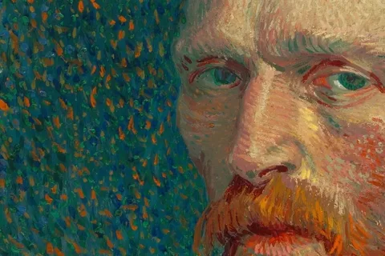
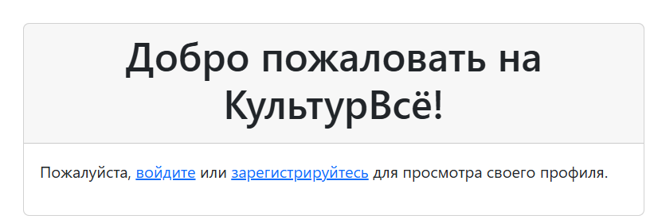

# CultureAll

 - сайт для знакомства с культуром и искусством, работающий бесплатно для каждого ценителя творчества. Здесь можно узнавать новое и искать интересные места.

 Ресурс для творческих людей, которые делают *новое*!

 ## Необходимые требования. ##
  Для корректной работы требуется установить *Python* версии  *3.12.3*

 ___
 ### Как установить. ###
 > Для работы с файлами потребуется Python версии 3.12.3

 1. После установки языка Python нужно установить Flask, используя командную строку.
    >python -m venv fproject\venv 
    

       * Переходим в созданную директорию.
    >cd fprojectMotuz
     

       * Активируем окружение
      >venv\scripts\activate
    
       * Устанавливаем Flask
      >pip install flask
     
2. Запускаем приложение в командной строке.
   >(venv)C:\Users\User\fproject>app.py
3. Или перейдите на сайт...
   >[CultureAll](https://myproject-graq.onrender.com/ "Ссылка на сайт")
___
#### Как пользоваться? ####

≽^- ˕ -^≼

Создайте аккаунт, придумайте себе юзернейм и запомните пароль - в будущем вы будете заходить на сайт под этими данными. В личном кабинете вы всегда сможете поменять вашу учетную запись!

1. **При входе на сайт выберите войти или зарегестрироваться.Войти - если у вас уже есть учетная запись, зарегестрироваться - если вы посещаете сайт впервые**

 >При регистрации *запомните* данные, которые вы указали.

2. **Перед вами появится ваша учетная запись: можете изменить данные или выйти из аккаунта.**

3. **Начните пользоваться сайтом!**

≽^- ˕ -^≼

 

     
    

